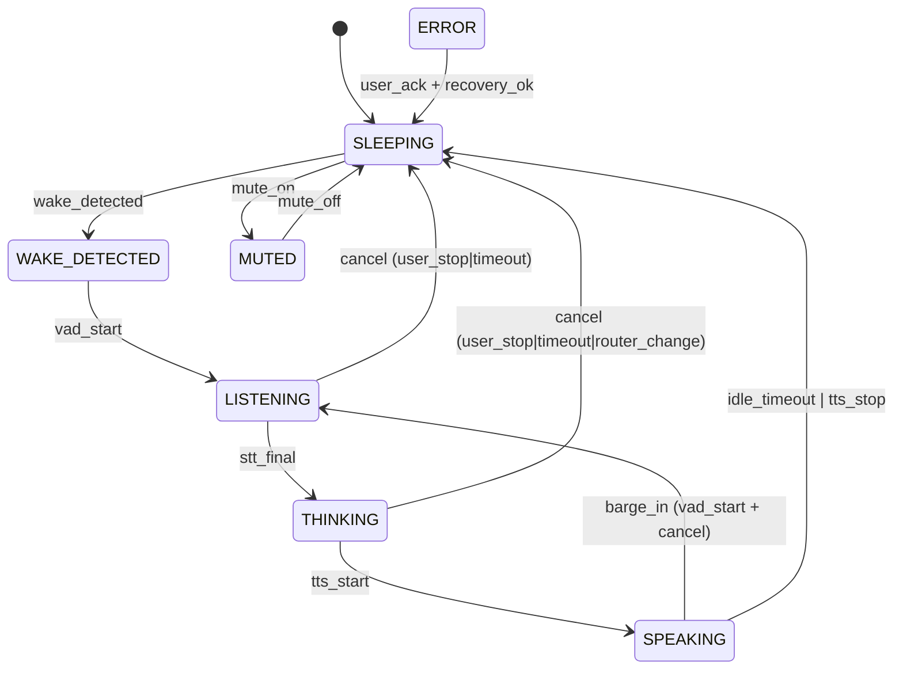

# Architecture — WANDA Vox Voice OS

*Last updated: 2026-02-24 · Version: 2.0*

---

## 1. Process Topology

```
┌────────────────────────────────────────────────────────┐
│  voice-engine (Python / FastAPI)                       │
│  Audio capture → DSP → Wake → VAD → STT               │
│  → Router → LLM Bridge → TTS → Playback               │
│  WebSocket: /ws/events  /ws/command                    │
└─────────────────────┬──────────────────────────────────┘
                      │  WebSocket (events + commands)
        ┌─────────────┴─────────────┐
        │                           │
┌───────▼────────┐       ┌──────────▼──────────────────┐
│  ui-orb        │       │  ui-mcc (Browser)            │
│  (GTK4 Python) │       │  Neural Nexus Design         │
│  Layer-shell   │       │  vanilla HTML/JS/CSS         │
│  Wayland OSD   │       │  Neural canvas + all panels  │
└────────────────┘       └─────────────────────────────┘
```

---

## 2. Console Session Manager

**File:** `backend/console/ConsoleSessionManager.ts`

Manages the persistent Gemini CLI / Ollama process. Implements the **idempotent session lifecycle**.

### Rules (Non-Negotiable)

| Trigger | Action |
|---|---|
| Nothing running | Start fresh (`initial_start`) |
| Backend unchanged, profile changed | Apply in-session, **no restart** |
| Backend switch (Gemini ↔ Ollama) | Clean stop → new session (`backend_switch`) |
| `applySettings()` called | Restart only if backend changed |
| Bridge process exits unexpectedly | Watchdog restart (`crash`) |
| Manual force restart | Clean stop → new session (`manual`) |

### API

```typescript
// Idempotent: only acts if state needs to change
await csm.ensureRunning({ backend: 'gemini_cli', profile: 'fast' });

// Apply settings diff — restarts only affected services
await csm.applySettings({ profile: 'reasoning' });

// Model switch within same session — NO restart
await csm.switchModel('reasoning');

// Force restart with documented reason
await csm.forceRestart('manual');
```

### Events emitted

- `started`        — session up
- `stopped`        — session down
- `restarting`     — restart in progress + reason
- `config_updated` — in-session config change (no restart)
- `model_switched` — model changed in-session
- `bridge_output`  — LLM bridge stdout
- `bridge_error`   — LLM bridge stderr
- `start_failed`   — spawn failed

---

## 3. State Machine



---

## 4. Routing Mode State Machine

Toggled by clicking the Orb or modeBadge. Affects where voice/text requests are routed.

```
GEMINI ──[click orb]──► WINDOW_INSERT
WINDOW_INSERT ──[click orb]──► GEMINI
```

| Mode | Behavior |
|---|---|
| `GEMINI` | Voice → STT → Router → LLM bridge → TTS |
| `WINDOW_INSERT` | Voice/text → appended to Dev Context buffer (no LLM invocation) |

---

## 5. Console Mode

Toggled by Ctrl+M or CLI/STT toggle buttons.

| Mode | Active Services |
|---|---|
| `cli` | Console + LLM routing + TTS |
| `simple_stt` | STT pipeline only. Raw transcript output. No LLM loop. |

Switching modes sends `set_console_mode` command to engine. Only affected services are started/stopped.

---

## 6. Event Bus Schema

All events include:

```json
{
  "schema_version": "1",
  "session_id": "uuid",
  "event_id": "uuid",
  "timestamp": 1740000000000,
  "component": "stt|llm|tts|...",
  "type": "stt_final",
  "payload": {}
}
```

See `shared/state/types.ts` for complete `EventType` union and payload shapes.

---

## 7. Cancellation (Hard Requirements)

- `cancel_request` emitted immediately on barge-in detection
- Audio playback stop target: **<100ms** (flush/stop sink)
- Pipeline cancel target: **<250ms** (CancelToken awaited)
- `cancel_done` confirms pipeline fully stopped
- Every long-running stage polls/awaits a session-scoped `CancelToken`

---

## 8. Observability

- **Perfetto Chrome JSON** — exported from MCC Debug/Replay panel
  - Format: `{ traceEvents: [{name, ph:"X", ts (μs), dur (μs), pid, tid, cat, args}] }`
  - Drop into `ui.perfetto.dev` for flame chart
- **OTEL spans** — optional backend tracing (`otel-file-exporter` → `traces/otel.jsonl`)
- **Run Manifest** — per-session JSON with config snapshot + model versions + artifact SHA256 refs

---

## 9. Security

- Skills execute only via explicit allowlist
- Per-skill permissions: `safe | confirm | blocked`
- Dev Context block is always marked `[UNTRUSTED]` in LLM prompt
- Hard mute: audio capture stopped at process level
- Bridge isolated HOME optional (prevents reading user config)
