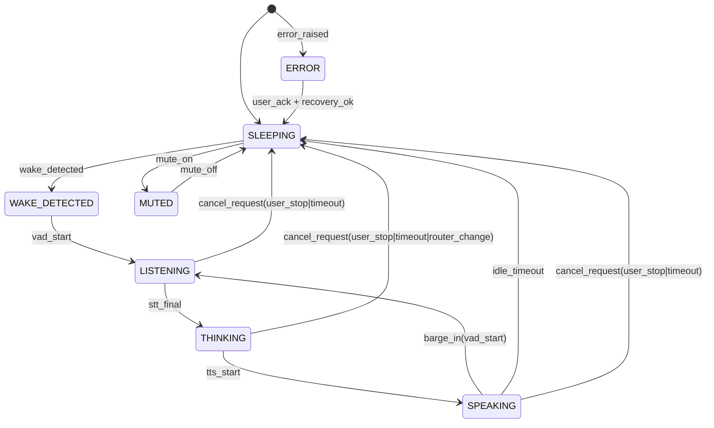

# Events & State Machine (v1)

## State machine

## Event types (required)
Core:
- audio_level (mic), audio_level_out (tts/playback)
- wake_detected
- vad_start / vad_end
- stt_partial / stt_final
- router_decision
- action_start / action_end
- llm_stream_chunk / llm_done
- tts_start / tts_chunk / tts_stop
- dev_context_attached

Extended:
- audio_device_changed
- dsp_state (aec_on, ns_level, agc_mode, echo_likelihood)
- cancel_request (reason: barge_in|user_stop|timeout|router_change)
- cancel_done
- run_manifest_written (artifact refs)
- error_raised (component + stack + code)
- watchdog_restart (component + reason)

## Cancellation semantics (hard)
- `cancel_request` is emitted immediately when barge-in is detected.
- Playback stop target: <100ms (flush/stop sink).
- Pipeline cancel target: <250ms (cancel tokens awaited + confirm `cancel_done`).

Implementation rule:
- every long-running stage must poll/await a session-scoped CancelToken.
